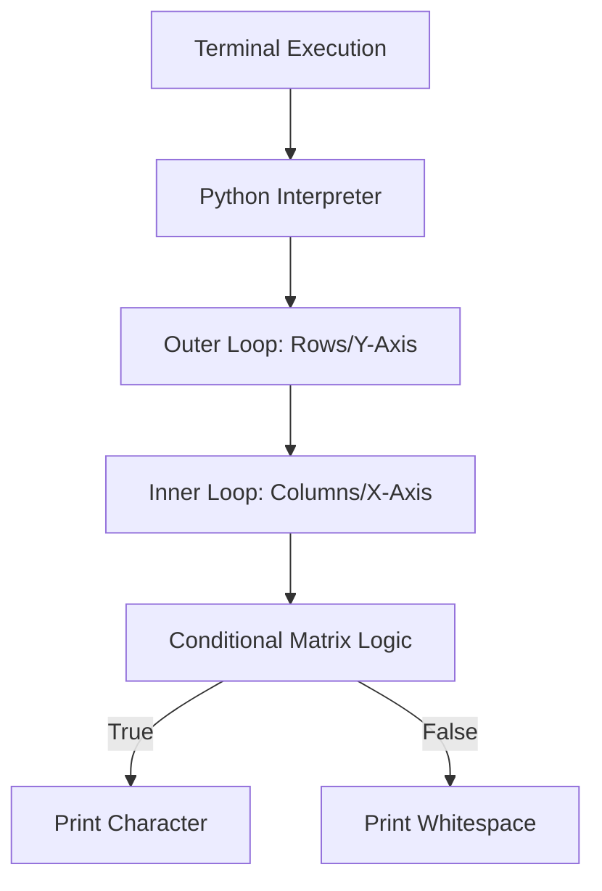

# Terminal Pattern Generation: Iteration Architecture

[]()
[]()
[]()

## Overview
This repository functions as an exhaustive logical reference for deeply nested iteration and conditional matrix rendering. It contains over 100 mathematical pattern generation algorithms written purely in Python, serving as a masterclass in `for-loop` and `while-loop` execution matrices.

## Problem Statement
Understanding how to manipulate nested arrays, coordinate grids, and multi-dimensional matrices is the foundational core of Data Structures & Algorithms (e.g., Matrix Traversal, Dynamic Programming grids). However, engineers often jump to advanced algorithms before mastering pure nested iteration. This repository solves that gap by providing standalone, mathematical loop structures that enforce strict comprehension of coordinate-based rendering.

## Key Features
- **Deep Nesting Mastery:** Complex nested $O(N^2)$ and $O(N^3)$ iteration structures demonstrating precise execution control.
- **Coordinate Matrix Rendering:** Mathematical generation of geometric shapes (pyramids, diamonds, numerical sequences) using pure terminal standard output (`stdout`).
- **Algorithm Isolation:** Every pattern is encapsulated in an isolated script (`pattern_01.py` through `pattern_100.py`) for targeted execution and modification.
- **Zero Dependencies:** Pure CPython execution without requiring any external `pip` packages.

## Architecture



## Technology Stack
- **Language:** Python 3.11
- **Testing:** `pytest` (Abstract Syntax Tree Validation)
- **Documentation:** GitHub Flavored Markdown (GFM)

## Project Structure
```text
python-patterns/
├── pattern_01_to_100.py     # Isolated matrix loop architectures
├── tests/                   # Pytest AST compilation verification
└── README.md                # System documentation
```

## Installation
Ensure Python 3 is installed natively on your OS.
```bash
git clone https://github.com/krsna016/python-patterns.git
cd python-patterns
```

## Usage
Compile and execute the specific pattern algorithm directly via the Python interpreter:
```bash
python3 pattern_42.py
```

## Examples
*Example logical matrix mapping for a Half-Pyramid:*
```python
n = 5
for i in range(1, n + 1):          # Outer row loop
    for j in range(1, i + 1):      # Inner column loop
        print("* ", end="")        # Matrix character logic
    print()                        # Row terminator
```

## Screenshots
> [!NOTE]
> *Educational algorithms execute via standard terminal output without GUI interactions.*

## Visual Demonstrations
> [!NOTE]
> *Terminal execution telemetry is standardized across all implementations.*

## Testing
We utilize a dynamic Pytest wrapper to programmatically validate the Abstract Syntax Tree (AST) across all 100+ pattern scripts. This ensures that no syntax degradation or legacy structural errors exist across the archive.
```bash
pytest tests/
```

## Performance Notes
- **Space Complexity:** All algorithms within this repository are constrained to an absolute minimal space footprint, utilizing $O(1)$ auxiliary space logic for pure terminal manipulation.

## Future Improvements
- **Argument Parsing:** Upgrade scripts to utilize `argparse` instead of static `n = 5` variables, allowing developers to inject matrix scaling factors directly from the CLI.
- **Mathematical Refactoring:** Refactor redundant loop logic utilizing Python's string multiplication mechanics (e.g., `print("*" * i)`) to optimize execution speed.

## Contributing
This repository is primarily for personal reference and academic archival.

## License
Licensed under the MIT License.
